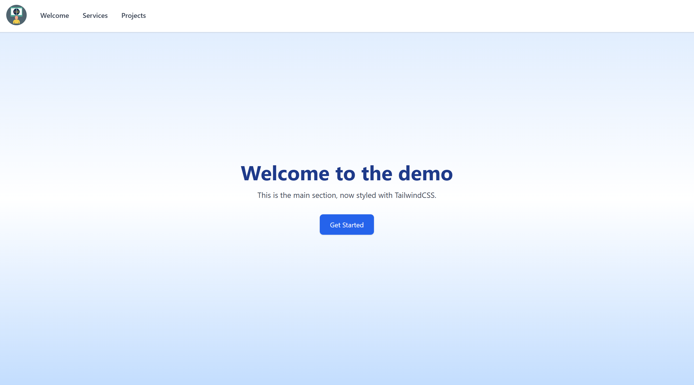
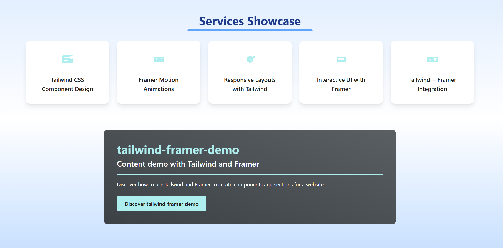
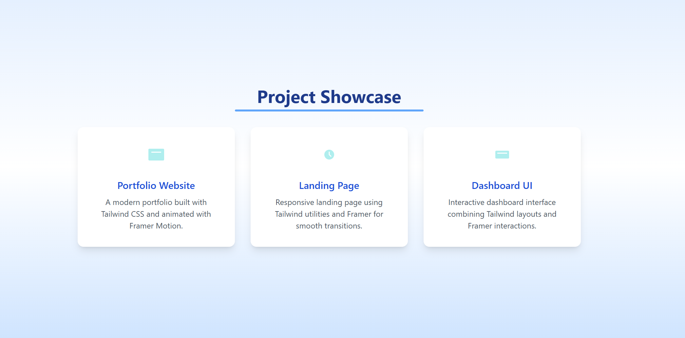

# Tailwind + Framer Motion Demo

<!-- Badges -->


This is a simple React project showcasing how to build sleek, animated UIs using **Tailwind CSS** and **Framer Motion**. It includes an animated tab switcher component as a starting point.

## 🚀 Features

- ⚡ Utility-first styling with Tailwind CSS
- 🎞️ Smooth animations with Framer Motion
- 🧩 Modular React components
- 💻 Ready to deploy or extend

## 📦 Installation

```bash
git clone https://github.com/your-username/tailwind-framer-demo.git
cd tailwind-framer-demo
npm install
npm start
```

## 📸 Screenshots

| Welcome Section | Services Section | Projects Section |
|--------------|-----------------|-----------------|
|  |  |  |

## 🛠️ Usage

1. Edit components in `src/components/sections` to customize sections.
2. Update Tailwind config in `tailwind.config.js` for custom colors or breakpoints.
3. Add new animated components using Framer Motion's `motion` API.
4. For deployment, use [Vercel](https://vercel.com/) or [Netlify](https://www.netlify.com/).

## 🧑‍💻 Development

- Hot reload enabled for rapid prototyping.
- All styles are handled via Tailwind utility classes.
- Animations are declarative and easy to extend.

## 🤝 Contributing

Pull requests, issues, and suggestions are welcome!  
Please follow the [code of conduct](CODE_OF_CONDUCT.md).

## 🙏 Acknowledgements

- [Tailwind CSS](https://tailwindcss.com/)
- [Framer Motion](https://www.framer.com/motion/)
- [React](https://react.dev/)
- [Vercel](https://vercel.com/)
- [Netlify](https://www.netlify.com/)
